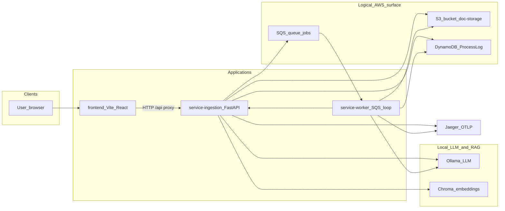
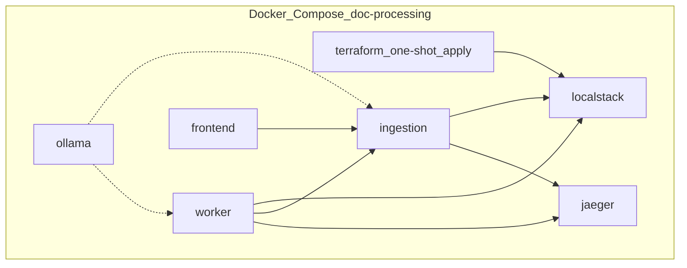
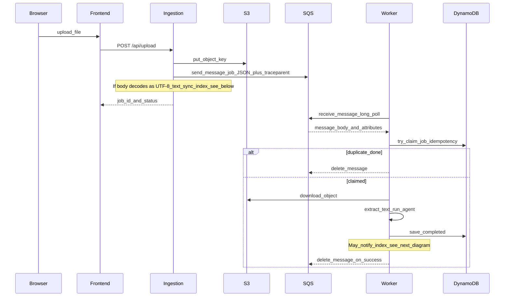
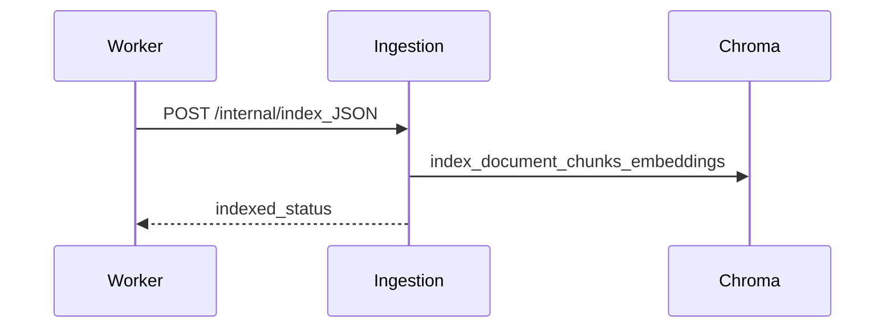
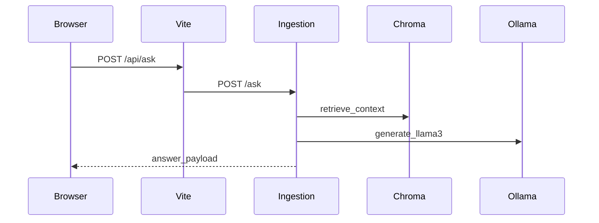

# Architecture

This document is the **onboarding map** for the repository: major components, how requests and background jobs flow, how local Docker Compose relates to an AWS-shaped deployment, and where configuration and CI fit in. For step-by-step local setup, use [local-dev.md](local-dev.md).

## System context

The product is a **local-first** stack: a browser UI talks to a FastAPI **ingestion** service, which stores uploads in **S3** and enqueues work on **SQS**. A **worker** polls the queue, reads objects from S3, runs a **LangGraph** flow (LLM classification and summary), writes status to **DynamoDB**, and can notify ingestion to **index** text into **Chroma** for RAG. **Ollama** serves the LLM from a **Docker Compose** service by default (or a host install when you run services on the host). **Jaeger** receives OTLP traces from ingestion and the worker.

The **Secrets Manager** secret `llm-config` exists in Terraform for future configuration; application code in this repo does not read it yet.

Terraform in [infra/main.tf](../infra/main.tf) provisions the AWS-shaped resources (S3 bucket, SQS main queue plus DLQ, DynamoDB table, Secrets Manager secret). Applications connect using URLs and names from environment variables (see [Configuration](#configuration)).

## Local deployment (Docker Compose)

Compose ([infra/docker-compose.yml](../infra/docker-compose.yml)) wires **LocalStack** for S3, SQS, DynamoDB, and Secrets Manager, runs **Terraform** once to create resources inside LocalStack, then starts **ingestion**, **worker**, **frontend**, **Jaeger**, and **ollama** (LLM).

Ports and commands are maintained in [local-dev.md](local-dev.md). Typical local ports include **4566** (LocalStack), **8000** (ingestion), **5173** (frontend), **16686** (Jaeger UI), and **11434** (Ollama).

## Logical AWS surface vs LocalStack today

| Resource | Name in this repo | Role |
|----------|-------------------|------|
| S3 bucket | `doc-storage` | Uploaded file bytes (`s3_key` = object key) |
| SQS | `jobs` (+ `jobs-dlq`) | Job messages; DLQ after max receives |
| DynamoDB | `ProcessLog` | Idempotency and job status (`MessageId` = job idempotency key) |
| Secrets Manager | `llm-config` | Placeholder secret for LLM-related config (extend as needed) |

The Terraform **provider** block targets LocalStack via `endpoints { ... }` and test credentials ([infra/main.tf](../infra/main.tf)). That is **not** a drop-in production root module.

### Pointing the same shape at real AWS

To run against real AWS you would typically: use default AWS SDK resolution (no custom `endpoints` block), **IAM roles or credentials** instead of static `test` keys, a remote **Terraform backend** and appropriate **secrets** handling, and real **queue URLs** and **bucket names** via variables or workspaces. Exact production layout (VPC, KMS, WAF, etc.) is a team choice and is intentionally not specified here.

## Shared contracts

**Job messages** on SQS are JSON matching [shared/job_schema.py](../shared/job_schema.py): `JobMessage` with `s3_key`, `idempotency_key` (UUID by default), and `uploaded_at`. The worker parses the body with `parse_job_message`.

**CORS** on ingestion allows the Vite dev origin (`localhost` / `127.0.0.1` port 5173); see [service-ingestion/app/main.py](../service-ingestion/app/main.py).

## Sequence: upload and async processing

After upload, the worker claims the job in DynamoDB (`try_claim_job`), downloads from S3, extracts text (PDF via PyPDF, otherwise UTF-8 where possible), runs `run_agent` (LangGraph), marks **Completed**, and may call ingestion to index. Trace context can flow **ingestion → SQS → worker** via `traceparent` message attributes ([publisher.py](../service-ingestion/app/publisher.py), [worker_app/tracing.py](../service-worker/worker_app/tracing.py)).

If `try_claim_job` returns **duplicate_inflight**, the worker raises `RuntimeError` so the SQS message is **not** deleted and becomes visible again after the visibility timeout ([worker.py](../service-worker/worker_app/worker.py) `run_once`).

**Sync indexing on upload:** For uploads whose bytes decode as UTF-8, ingestion calls `index_document` immediately after a successful publish ([main.py](../service-ingestion/app/main.py) `upload` handler). Binary formats (for example PDF) skip this path until the worker extracts text.

## Sequence: indexing callback (RAG corpus)

When the worker has extracted non-empty text, it notifies ingestion over HTTP so Chroma indexing runs inside the ingestion process (shared embedding model and persist directory).

Implementation: [processor.py `notify_index`](../service-worker/worker_app/processor.py), [main.py `/internal/index`](../service-ingestion/app/main.py), [rag_service.py `index_document`](../service-ingestion/app/rag_service.py) (chunking, `SentenceTransformer`, Chroma persistent collection `documents`).

## Sequence: ask and RAG

The UI uses `axios` with `baseURL: "/api"` ([frontend/src/App.jsx](../frontend/src/App.jsx)). Vite rewrites `/api` to the ingestion service ([frontend/vite.config.js](../frontend/vite.config.js)).

`/ask` is implemented in [main.py](../service-ingestion/app/main.py) and delegates to [rag_service.answer_question](../service-ingestion/app/rag_service.py) with [ollama_client.generate_llama3](../service-ingestion/app/ollama_client.py).

## Observability

- **Ingestion:** On startup, OTLP gRPC exporter to `OTLP_ENDPOINT` (normalized host:port), `service.name` = `service-ingestion`, plus `FastAPIInstrumentor` ([main.py](../service-ingestion/app/main.py)). RAG spans exist under [rag_service.py](../service-ingestion/app/rag_service.py).
- **Worker:** Same OTLP pattern with `service.name` = `service-worker` ([worker.py](../service-worker/worker_app/worker.py)). Each handled message attaches context from `traceparent` SQS message attributes when present, then creates a `worker-process` span. LangGraph / LLM code adds nested spans ([langgraph_flow.py](../service-worker/worker_app/langgraph_flow.py)).

Compose sets `OTLP_ENDPOINT` to `jaeger:4317` for both services ([docker-compose.yml](../infra/docker-compose.yml)).

## CI pipeline

[.github/workflows/pipeline.yml](../.github/workflows/pipeline.yml) runs in parallel:

1. **python** — Python 3.11, `pip install -r requirements.txt flake8`, flake8 with a narrow error selection on `service-ingestion`, `service-worker`, `shared`, then `python -m pytest -q`.
2. **frontend** — Node 20, `npm ci` and `npm run build` in `frontend/`.
3. **terraform** — Terraform 1.7, `fmt -check`, `init -backend=false`, `validate` in `infra/`, then **tfsec** in Docker with `--soft-fail`.
4. **compose-config** — `docker compose config --quiet` in `infra/` to validate the Compose file.

## Configuration

Environment variables are loaded via Pydantic settings in [service-ingestion/app/config.py](../service-ingestion/app/config.py) and [service-worker/worker_app/config.py](../service-worker/worker_app/config.py). [.env.example](../.env.example) documents overrides for host-native dev and CI.

| Concern | Variables (common names) |
|---------|---------------------------|
| AWS / LocalStack endpoint | `AWS_ENDPOINT_URL` (alias `AWS_ENDPOINT`) |
| Queue and storage | `QUEUE_URL`, `BUCKET_NAME`, `DYNAMODB_TABLE` |
| Tracing | `OTLP_ENDPOINT` (alias `OTEL_EXPORTER_OTLP_ENDPOINT`) |
| Worker → ingestion callback | `INGESTION_BASE_URL` |
| LLM | `OLLAMA_BASE_URL`, `OLLAMA_MODEL`, `OLLAMA_HTTP_TIMEOUT_SECONDS`; tests/CI may set `LLM_MOCK_JSON` |
| RAG / embeddings | `CHROMA_PERSIST_DIR`, `EMBEDDING_MODEL_NAME` |
| Frontend dev proxy | `INGESTION_PROXY_TARGET` (Vite; see vite.config.js) |

Compose sets service-to-service URLs (for example `AWS_ENDPOINT_URL=http://localstack:4566`, `INGESTION_BASE_URL=http://ingestion:8000`). A repo-root `.env` is optional and merged where `env_file` is declared in Compose.

## Where to read code next

| Area | Entry points |
|------|----------------|
| Ingestion API and lifespan | [service-ingestion/app/main.py](../service-ingestion/app/main.py) |
| SQS publish and trace injection | [service-ingestion/app/publisher.py](../service-ingestion/app/publisher.py) |
| RAG index / retrieve / answer | [service-ingestion/app/rag_service.py](../service-ingestion/app/rag_service.py) |
| Worker loop and tracing | [service-worker/worker_app/worker.py](../service-worker/worker_app/worker.py) |
| S3 download, DynamoDB claim, LangGraph | [service-worker/worker_app/processor.py](../service-worker/worker_app/processor.py), [langgraph_flow.py](../service-worker/worker_app/langgraph_flow.py) |
| UI | [frontend/src/main.jsx](../frontend/src/main.jsx), [frontend/src/App.jsx](../frontend/src/App.jsx) |
| Shared job JSON | [shared/job_schema.py](../shared/job_schema.py) |

## Related docs

- [local-dev.md](local-dev.md) — run, verify, teardown, optional LLM profile, troubleshooting  
- [engineering-journal.md](engineering-journal.md) — sprint notes and context  
- [cursor-agent-workflow.md](cursor-agent-workflow.md) — Cursor-specific contributor workflow  
