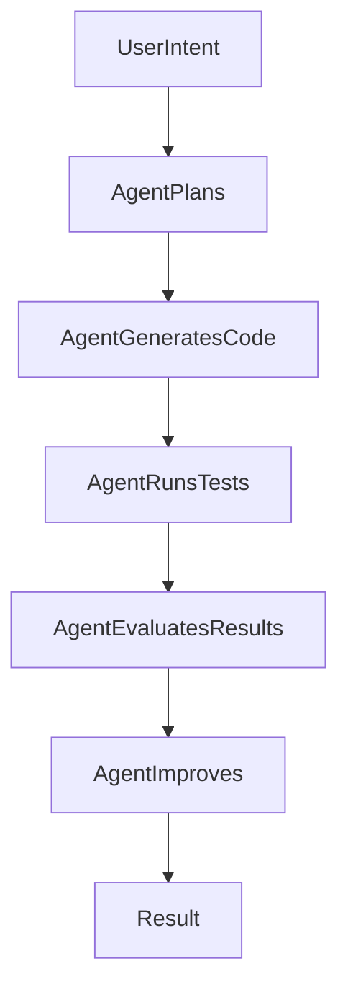
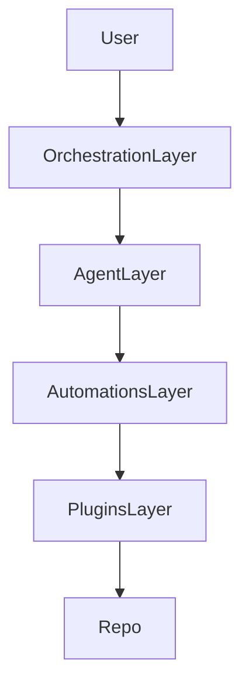
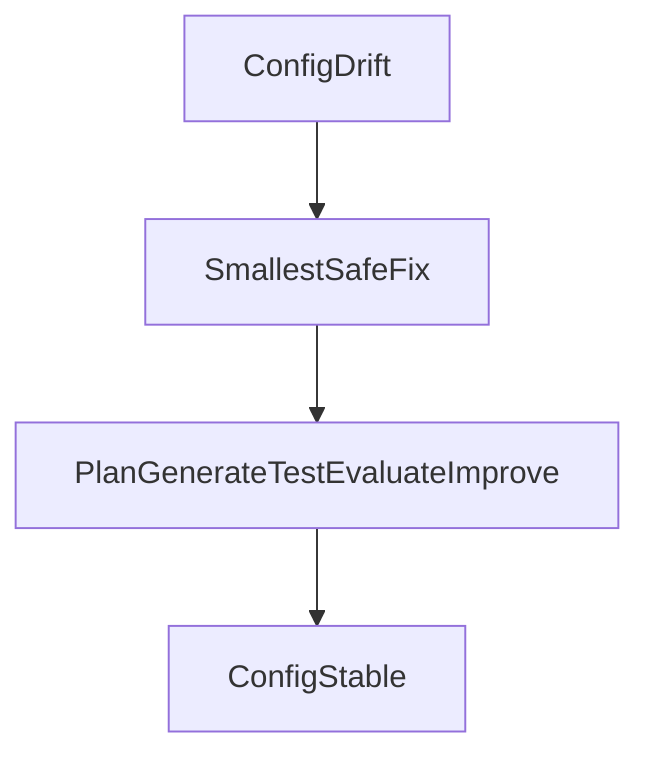

# Cursor and agent workflow (contributors)

This page is for **humans and agents working in the repository**. It describes how Cursor is configured and how we expect agents to behave. It is **not** runtime or product behavior documentation. For running the stack, see [local-dev.md](local-dev.md).

## Core mental model

Everything runs through this loop:

> Plan → Generate → Test → Evaluate → Improve

## Workflow diagram

### High-level flow

### Layered view (conceptual)

These layers describe how Cursor fits around the repo, not separate services in this project:

### Config drift and correction

When `.cursor/rules` or related config drifts, a **human or agent** applies the smallest safe fix, following the same loop until config is stable. There is no separate automated “guardian” job in this repo.

## Common tasks

### Implement a feature

Ask the agent to plan the minimal implementation, then follow Plan → Generate → Test → Evaluate → Improve (see [`.cursor/rules/agentic-core.mdc`](../.cursor/rules/agentic-core.mdc)).

### Fix a bug

Ask for the minimal root-cause fix, smallest safe change, and verification with tests.

### Add tests

Ask for minimal, high-value tests that cover the change and prevent regressions.

## Parallel sub-agents

When to use parallel readonly exploration vs disjoint write lanes, and when the parent must integrate and run checks, is defined in [`.cursor/rules/coordination.mdc`](../.cursor/rules/coordination.mdc) under **Parallelism and sub-agents**.

## Automations

Recommended Cursor automations:

- Fix CI Failures
- Add Test Coverage
- Assign PR Reviewers (optional)

## Plugins

Recommended plugins:

- Sourcegraph
- Aikido
- Sonatype

## Rule maintenance

If `.cursor/rules/*.mdc` drifts or contradicts itself, apply the smallest safe fix. When **editing** those files, follow [`.cursor/rules/rule-authoring.mdc`](../.cursor/rules/rule-authoring.mdc).

## Document platform (local run)

See [local-dev.md](local-dev.md) for Docker Compose (recommended) or host-based scripts.
